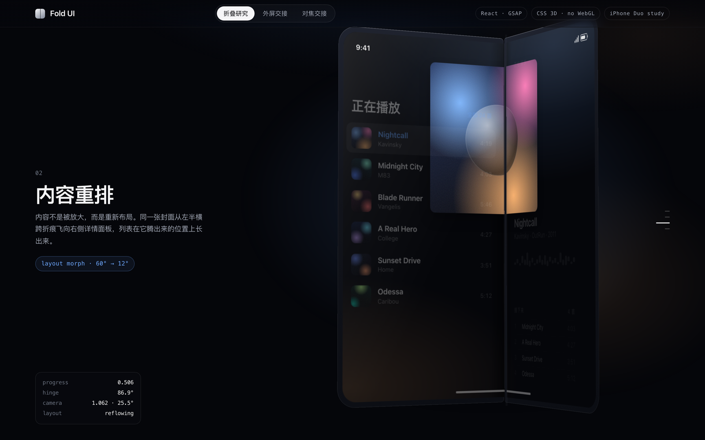
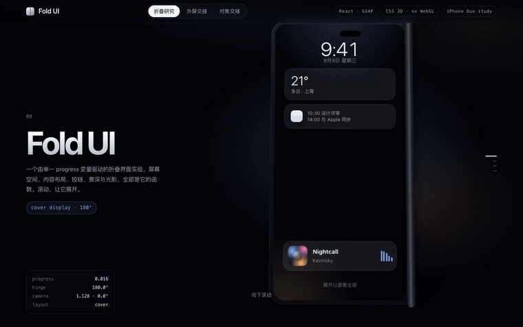
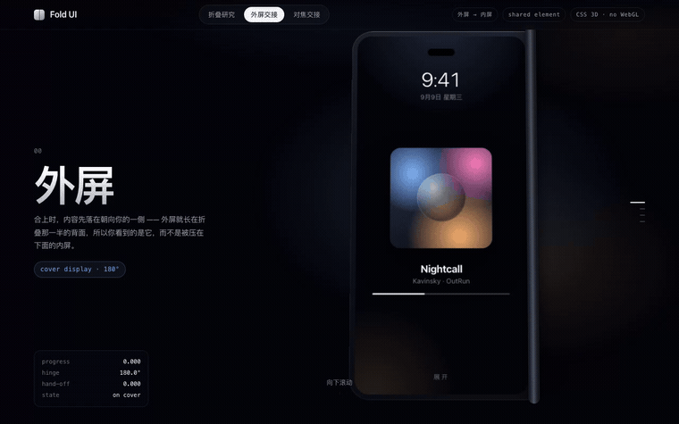
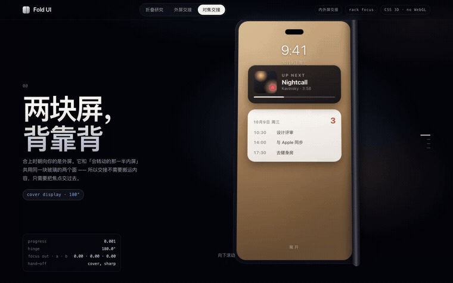
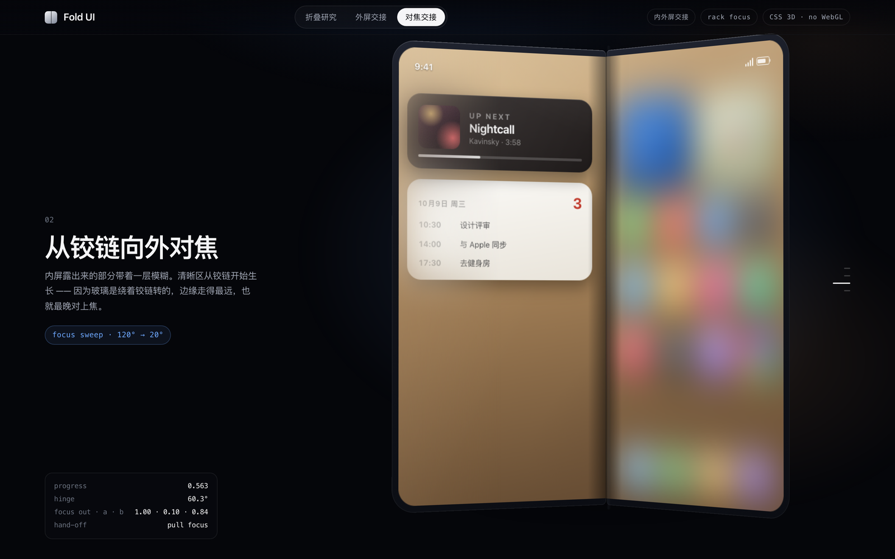
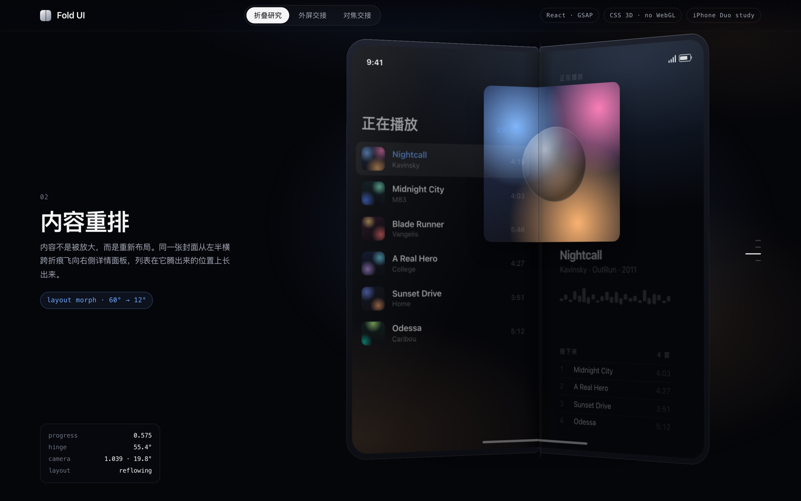
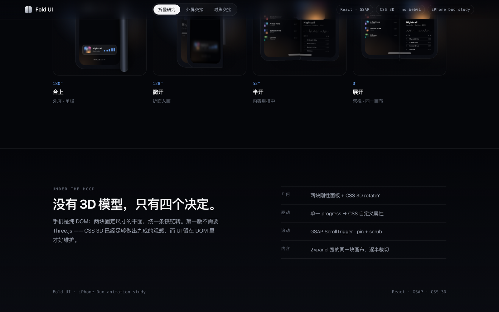

# 我把苹果发布会里的折叠屏，真的用网页做出来了

事情是这样的。

前两天看苹果新手机发布会，看到那台手机从合上慢慢展开，屏幕从一块变成两块，内容还自己重新排了一遍。

我当时就一个感觉，卧槽，屏幕居然还能这样长大？

更离谱的是，那个画面看起来不像手机在动，更像是界面在呼吸。

于是我干了一件有点不务正业的事，用 React、CSS 3D 和 GSAP，在浏览器里折了一台手机。

没有 WebGL，没有 three.js，没有 3D 模型。

**就是网页，打开就能玩。**

## 先看效果，滚动就能展开

你可以直接打开项目体验，鼠标往下滚，手机会从合上展开。手机上也能上下拖动机身，停在任意一帧。

*合上 → 半开 → 展开，内容跟着屏幕一起变化。* · [高清 MP4](assets/00-fold.mp4)

我最开始以为，折叠屏嘛，不就是两块矩形绕着中间转一下？真正做起来才发现，转起来只是第一关。

因为真实的折叠屏，不只是外壳在转。

铰链在转，相机在动，屏幕反光在变，景深在变，内容也得跟着重新排。只要有一个地方慢半拍，画面就会立刻露馅，像 PPT 翻页。

这玩意最难的地方，恰恰不是把手机折起来，而是让它折起来的时候，看起来像一台真的手机。

## 外屏转走了，封面怎么留下来？

先说那个最容易把人整不会的地方。

合上时，外屏朝着你。它其实在会转动的那一半的背面。

手机一展开，外屏物理上就转到背后去了。于是外屏上的封面也应该跟着一起消失。

可发布会里的感觉不是这样。那张封面像被手机记住了，它从外屏上被提起来，穿过折痕，最后落到内屏右边的详情区域。

所以我做了一个飞行层。

*留意封面的位置，从外屏出发，落到内屏。* · [高清 MP4](assets/00-cover-flight.mp4)

这张封面不是淡出，也不是复制一份贴到右边。它真的会从原来的位置出发，悬起来，横跨折痕，再落回界面里。

而且它全程没有飞出手机轮廓，左右两块玻璃还在夹着它。

我后来才发现，这个效果最关键的不是飞行曲线，而是飞行层放在哪里。

**它必须是相机的兄弟节点，不能塞进相机里面。**

不然折到 165 度左右，右半边会朝观众翘起来，远端在 z 轴上已经跑到玻璃前面。你给封面加一点点抬升，它还是会被面板盖住，然后啪一下消失。

这种 bug，代码看着完全没问题，眼睛一看就知道不对。

我盯着那一帧看了很久，最后才意识到，问题不是封面飞得不够高，是它在错误的空间里飞。

这就是做动效特别有意思的地方。

> 很多时候你以为自己在调动画，实际上是在调空间关系。

## 内屏慢慢对上焦，才有那个感觉

还有一个坑，内屏不能直接淡入。

你想想真实世界里的相机，外屏还清楚的时候，刚露出来的内屏不可能立刻高清。它应该先虚着，等转到正面，焦点再慢慢过去。

所以我没有做简单的透明度交叉。

我做的是一次对焦交接。

*外屏失焦，内屏逐渐清晰。* · [高清 MP4](assets/00-focus-pull.mp4)

外屏慢慢失焦，内屏从铰链附近开始变清楚，然后清晰区域一点点往外扩。

一开始我把外屏的模糊放得太早，手机还没怎么动，封面已经糊成马赛克了。内屏也很生猛，一露头就是满级重影，像有人把两张图硬贴在一起。

后来我把它拆成几条独立曲线。

外屏晚一点糊，内屏先浅浅地糊，再慢慢变清楚。这样眼睛看到的就不是切换，而是焦点真的从一块玻璃交给了另一块玻璃。

这段节奏我调了整整一晚上。

愚钝如我，最后还是靠一帧一帧截图，才把那个感觉磨出来。

## 一台手机，所有动作只认一个数字

那这台手机到底是怎么跑起来的？其实没那么神秘。

手机就是左右两块刚性平板，右半边绕着中间的铰链转，角度从 180 度走到 0 度。

所有动作都只认一个数字，叫 `progress`，从 `0` 到 `1`。

> `0` 是合上，`1` 是完全展开。

铰链角度、相机推拉、相机偏航、折痕强度、景深、内容布局、封面飞行，全都是这个数字算出来的。

这样做有一个特别爽的地方，所有东西不会各动各的。

不会出现铰链已经开了，内容还没跟上，也不会出现相机停了，封面还在半空中发呆。

每一帧只更新 CSS 变量，不让 React 跟着重新渲染。滚动 60 帧，React 基本没有醒过来，浏览器只是在更新当前画面。

*展开后的双栏界面。*

*把连续动画停下来，看四个关键状态。*

内容也不是准备了两套页面。

我把它画在一张两倍宽的画布上，左右两个面板各自裁一半。这样跨过折痕的元素天然就是连续的，不需要手动算左边偏几像素、右边再补几像素。

## 那些说不出哪里不对的小细节

说到这里，可能有人会觉得，做这么多细节是不是有点过头了？

我也理解。你只是想看一个折叠动画，谁会在意一条折痕到底是 18 像素还是 12 像素。

但问题就在这里。

人眼对空间关系特别敏感。你不一定说得出哪里不对，但只要折痕太黑、焦点太快、阴影没跟上，马上就会觉得假。

发布会里的那几秒，真正厉害的地方也不是把手机折开，而是它把硬件动作翻译成了内容动作。

一块屏变成两块屏，界面没有让你重新学习。封面还在，列表长出来了，详情面板接住了你的视线。

这已经不只是 CSS 3D 了。

它更像是在做一件小型的空间设计。

## 你也可以上手折一折

你可以自己玩一下。

- **切换演示** · 折叠研究、外屏交接、内外屏对焦三个页面。
- **控制开合** · 拖动滑块，停在任意一帧；也可以点自动往返。
- **换个 App** · 播放器、邮件、图库，看看不同的内容重排方式。

项目已经放到 GitHub 了，代码和所有动效素材都在里面。

**[打开 GitHub 项目 → you-want/apple-duo-animation](https://github.com/you-want/apple-duo-animation)**

如果你也喜欢这种把发布会画面拆开、再用网页重新做一遍的项目，欢迎点个 star。

我还想继续往下磨，尤其是屏幕反光、玻璃边缘高光，还有那块几乎看不见的折痕。

毕竟折叠屏最性感的地方，从来不是它能不能折。

是它折完以后，内容还能不能接着长出来。

以上，既然看到这里了，如果觉得不错，随手点个赞、在看、转发三连吧，如果想第一时间收到推送，也可以给我个星标⭐～

谢谢你看我的文章，我们，下次再见。
