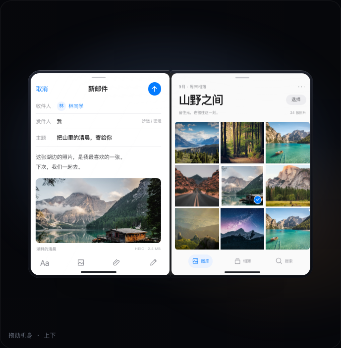

# iPhone Duo 内外屏交接：参考与修正

核对日期：2026-09-12。当前内屏：左侧邮件草稿、右侧照片图库；外屏：图库。修改页面：`#/handoff`（滚动演示与交互实验）。

## 一手来源

- Apple 产品页：`https://www.apple.com/iphone-duo/`
- 页面 `highlights-display` 视频：`https://www.apple.com/105/media/us/iphone-duo/2026/9305e4b9-72d9-4c05-9381-b572adadd5e5/anim/highlights-display/large.mp4`
- 视频从页面的 `data-inline-media-basepath` 定位，再根据官方页面脚本的断点命名规则取得 `large.mp4`。
- 下载后用 ffprobe 核实：1260 × 612、30 fps、3.000 秒。用 ffmpeg 每秒抽取 8 帧检查展开过程。

这是官网展示影片的视觉研究，不能据此推断真实设备的系统切屏阈值，或把影片的景深、材质表现都归因于 iOS 动画。

## 本轮补充核对

上一版参考的是锁屏短片，误把“整幅锁屏”当成此次用户需要的内屏内容。本轮按用户要求改成左右不同应用，并补看这些一手资料：

- 官网 Split View 示例图：`https://www.apple.com/v/iphone-duo/a/images/overview/product-stories/versatility/apps_standby__b0akmv815b1e_large.jpg`。图中左侧是邮件编辑与照片附件，右侧是三列图库，右边缘有竖向工具栏。
- 官网 versatility 动画：`https://www.apple.com/105/media/us/iphone-duo/2026/9305e4b9-72d9-4c05-9381-b572adadd5e5/anim/highlights-versatility/large.mp4`。展示多种设备姿态和并排应用；它不能证明“锁屏打开后直接切到双应用”的完整时序。
- 官网交互场景：`https://www.apple.com/v/iphone-duo/a/static/scenes/iPhoneDuo_US_L_avif.lsd`。由页面 `data-rt-scenes` 和脚本的 `_avif` 后缀规则定位。
- 对照官网 `main.built.js` 的 Wipe shader：模糊取决于横向 UV 与 wipePosition 的距离；场景内屏 blurBounds 为 [0.45, 1]，外屏为 [0, 0.9]，maxBlur 为 10。这确认它是空间变化的柔化，而非统一透明度淡入；这些默认值不等于完整动画曲线。

实现组合了官网的开合视觉与 Split View 布局。外屏图库延续到内屏右侧、左侧出现已有邮件草稿是本项目的演示编排，不声称是一段官方录屏的逐像素复刻，也不声称展开动作会解锁或自动打开应用。

## 锁屏影片的逐段观察（作为开合参考）

| 视频时间（约） | 能看到的行为 | 原项目的差异 |
| --- | --- | --- |
| 0–0.75 秒 | 窄屏锁屏保持可读，设备开始转动 | 使用小组件桌面，外屏同时模糊并降低透明度 |
| 0.75–1.5 秒 | 外屏随左侧折面转走；后方右侧内屏显露，细节基本清晰 | 展开方向相反，固定内屏也经历大范围模糊 |
| 1.5–2.5 秒 | 左侧折面摊开，柔和区域逐渐收缩；时间向完整画布中央归位 | 两半各自套用不一致的清晰区遮罩，时钟和布局无连续性 |
| 2.5–3 秒 | 完整横向锁屏，左右连续且清晰 | 原内屏为较方的小组件双栏界面 |

以上时间为抽帧观察范围，不是 Apple 公布的精确曲线。参考闭合机身的高宽比约 1.46；这是画面估算，不是硬件尺寸规格。

## 实现

- 交接页采用左侧折面、右侧固定面，保留几何背面剔除；外屏不额外降低透明度。
- 外屏只保留较轻的离场柔化；固定右屏始终清晰。左屏柔化区域在原始双倍宽画布上计算，向外缘退去。展平时 filter 为 none。
- 原遮罩用整块双倍宽画布的百分比表示半屏，实际清晰边界错误；现在半屏最多占画布的 50%。
- 内屏左右分别绘制邮件与图库，共享选中照片与附件的摄影素材；每个面板裁切自己的半幅，不跨铰链拉伸或搬运内容。外屏展示同一图库。图片使用本地保存的 Unsplash 风景摄影，来源记录于 `src/assets/duo/SOURCES.md`，不是官网照片。没有把官网视频作为页面动画播放。
- 新增参考场景相机和比例参数；原折叠页与封面飞行页继续使用各自布局。原 handoff.css 的全局外屏 filter/opacity 被移除，避免其他页面受到影响。
- 滑块和反向合拢使用同一标量，没有依赖播放方向的残留状态。

## 保真边界

参考开合方向、显示面交接、并排应用布局与空间柔化；图片、字体、材质及相机曲线是近似实现。保留原有滚动控制，因此滚动时长不等于参考影片的三秒。

## 验证

生产构建、桌面与 390px 手机布局；展开关键帧截图；原两页外屏 filter 为 none。运行时检查无页面错误或横向页面溢出。交互可在 `#/handoff` 的 Playground 拖动和自动往返查看，页面也提供原始视频入口。

## 界面视觉更新

移除重复的人物占位插画，改用八张风景摄影。邮件采用紧凑字段、统一文字层级与大图附件；图库采用留白标题、九宫格和底部导航。统一 SVG 线条图标，并按面板尺寸缩放间距。开合逻辑保持不变。

